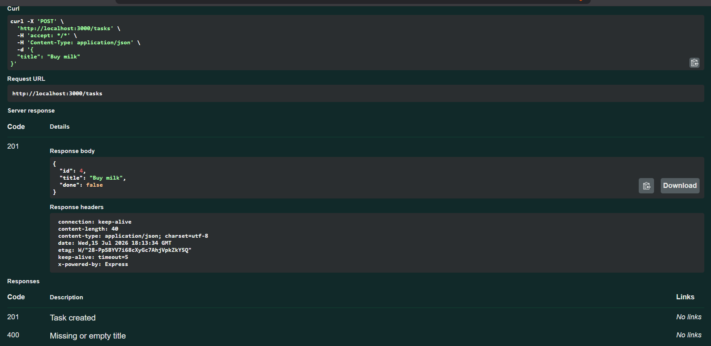

# Task API

A small in-memory CRUD API for managing a to-do list, built with **Node.js + Express**.

This is a Week 2 assignment: build the four CRUD operations (Create, Read, Update, Delete),
expose them through Swagger UI, and publish to GitHub. Data is stored **in memory only** —
it resets every time the server restarts (that's intentional; databases come next week).

## How to run it

```bash
npm install
npm start
```

The server starts at `http://localhost:3000`.
Interactive docs (Swagger UI) are at `http://localhost:3000/docs`.

## Endpoints

| Method | Path | Description | Success | Errors |
|---|---|---|---|---|
| GET | `/` | API info | 200 | — |
| GET | `/health` | Health check | 200 | — |
| GET | `/tasks` | List all tasks (supports `?done=true`, `?search=milk`) | 200 | — |
| GET | `/tasks/:id` | Get one task | 200 | 404 if not found |
| POST | `/tasks` | Create a task (`{ "title": "..." }`) | 201 | 400 if title missing/empty |
| PUT | `/tasks/:id` | Update a task's `title` and/or `done` | 200 | 400 invalid body, 404 not found |
| DELETE | `/tasks/:id` | Delete a task | 204 | 404 if not found |
| GET | `/stats` | Task counts: total/done/open | 200 | — |
| POST | `/reset` | Reset to the 3 seed tasks | 200 | — |

## Example request

```bash
curl -i -X POST http://localhost:3000/tasks \
  -H "Content-Type: application/json" \
  -d '{"title":"Buy milk"}'
```

```
HTTP/1.1 201 Created
Content-Type: application/json; charset=utf-8

{"id":4,"title":"Buy milk","done":false}
```

## Swagger screenshot




## The mortality experiment

Create a few tasks, restart the server (`Ctrl+C` then `npm start` again), then `GET /tasks`.

_Add 2 sentences here about what you observed and why — this is the reason in-memory storage
gets replaced by a real database next week._

## Project structure

```
task-api/
├── server.js       # all routes and CRUD logic
├── openapi.json     # hand-written OpenAPI spec for Swagger UI
├── package.json
└── README.md
```
